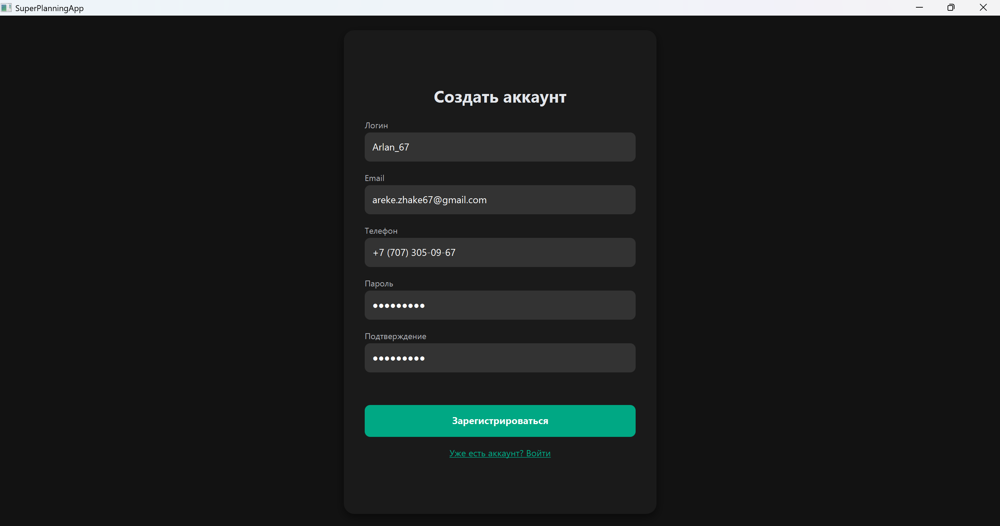
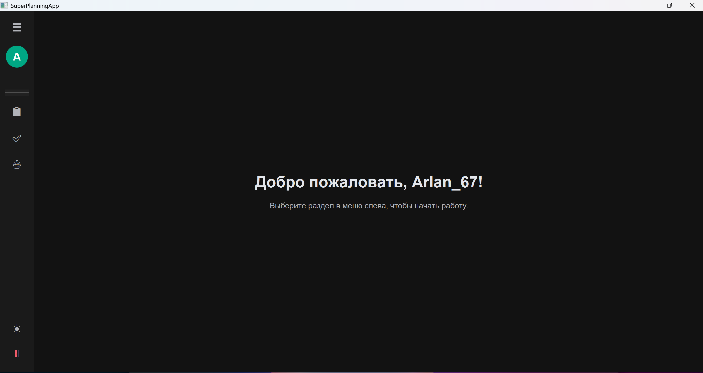
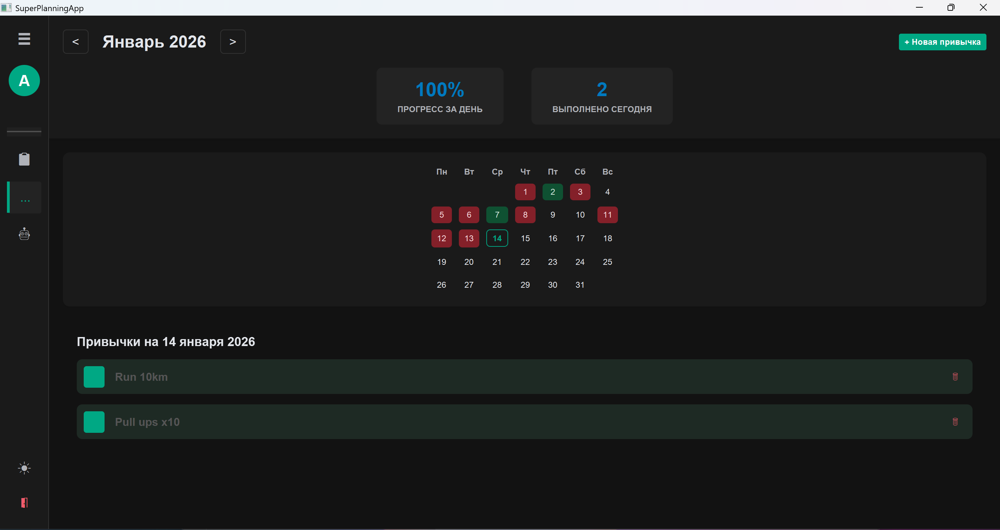
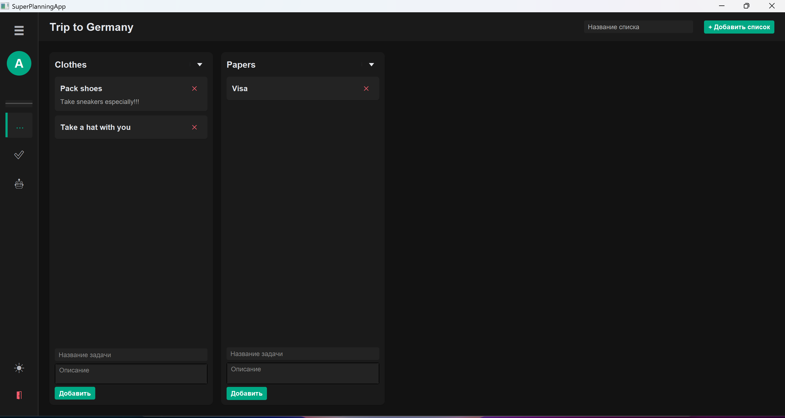
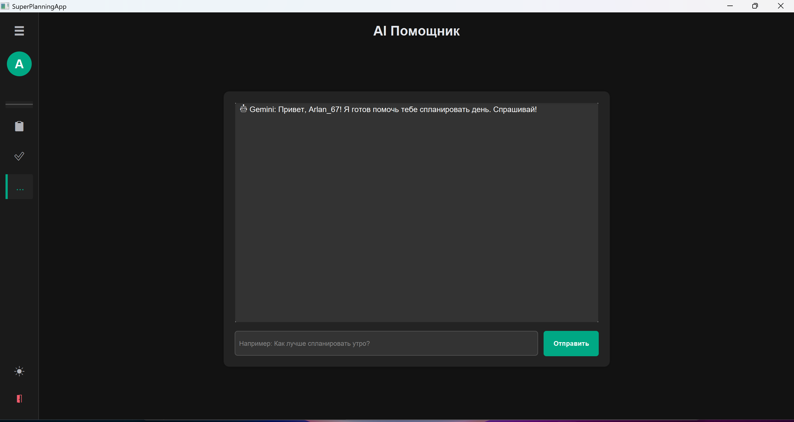

# 🚀 SuperPlanningApp

<div align="center">


**Мощное desktop-приложение для планирования задач, отслеживания привычек и управления проектами с AI-ассистентом**

[Демо](#) • [Документация](#) • [Сообщить об ошибке](#)

</div>

---

## 📋 Оглавление

- [О проекте](#-о-проекте)
- [Основные возможности](#-основные-возможности)
- [Технологический стек](#-технологический-стек)
- [Установка и настройка](#-установка-и-настройка)
- [Использование](#-использование)
- [Структура проекта](#-структура-проекта)
- [Переменные окружения](#-переменные-окружения)
- [Настройка базы данных](#-настройка-базы-данных)
- [Разработка](#-разработка)
- [Лицензия](#-лицензия)

---

## 🎯 О проекте

**SuperPlanningApp** — это полнофункциональное desktop-приложение для управления задачами, привычками и проектами. Приложение объединяет в себе функциональность трекера привычек, Kanban-досок (в стиле Trello) и AI-ассистента для планирования распорядка дня.

Приложение разработано с использованием JavaFX и предоставляет современный, интуитивно понятный интерфейс для эффективного управления временем и задачами.

---

## ✨ Основные возможности

### 🔐 Аутентификация и безопасность
- 🔒 Регистрация и вход в систему
- 🔑 Безопасное хранение паролей с использованием BCrypt
- 👤 Управление профилем пользователя
- 🔍 Поиск пользователей для совместной работы

### 📋 Управление задачами (Trello-стиль)
- 📊 Создание и управление досками проектов
- 📝 Списки задач с возможностью перетаскивания
- 🎴 Карточки с описаниями и деталями
- 👥 Совместная работа над досками
- 📨 Система приглашений участников
- 🔔 Уведомления о событиях на досках
- 📂 Организация проектов по категориям

### ✅ Трекер привычек
- 📅 Календарное отслеживание привычек
- ✅ Отметка выполнения на каждый день
- 📈 Визуализация прогресса по месяцам
- 🎨 Цветовая категоризация привычек
- 📊 Статистика выполнения привычек

### 🤖 AI-ассистент
- 💬 Интеллектуальный чат для планирования распорядка дня
- 🧠 Использование Google Gemini API
- 💡 Персональные рекомендации по управлению временем
- 🎯 Фокус на вопросах планирования и продуктивности

### 🎨 Пользовательский интерфейс
- 🌓 Темная и светлая темы
- 📱 Адаптивный дизайн с минимальными размерами окна
- 🎯 Интуитивная навигация с боковым меню
- ⚡ Плавные анимации и переходы
- 🎨 Современный Material Design стиль

### 🗄️ База данных
- ☁️ Интеграция с AWS RDS PostgreSQL
- 🔄 Пул соединений HikariCP для оптимизации
- 🔒 Безопасное подключение через переменные окружения
- 📊 Нормализованная схема базы данных

---

## 🛠 Технологический стек

### Core
- **Java 17** — Язык программирования
- **Maven 3.8+** — Система сборки и управления зависимостями
- **JavaFX 21.0.6** — UI фреймворк для desktop-приложений

### JavaFX Libraries
- **ControlsFX 11.2.1** — Дополнительные UI компоненты
- **FormsFX 11.6.0** — Формы и валидация
- **ValidatorFX 0.6.1** — Валидация данных
- **Ikonli 12.3.1** — Иконки
- **BootstrapFX 0.4.0** — Bootstrap стили для JavaFX
- **TilesFX 21.0.9** — Современные UI компоненты

### Database & Connection
- **PostgreSQL 42.7.7** — JDBC драйвер
- **HikariCP 5.1.0** — Пул соединений для оптимизации
- **AWS RDS** — Облачная база данных

### Security & Utilities
- **BCrypt 0.4** — Хеширование паролей
- **dotenv-java 3.0.0** — Управление переменными окружения
- **JSON 20240303** — Работа с JSON

### AI & APIs
- **Google Gemini API** — AI-ассистент для планирования
- **Java HTTP Client** — Асинхронные HTTP запросы

### Testing
- **JUnit Jupiter 5.12.1** — Фреймворк для тестирования

---

## 🚀 Установка и настройка

### Предварительные требования

- **Java 17+** (JDK)
- **Maven 3.8+**
- **PostgreSQL** (локально или AWS RDS)
- **Git**
- API ключ **Google Gemini** (для AI-функций)

### Шаги установки

1. **Клонируйте репозиторий**
   ```bash
   git clone https://github.com/ArekeZh/SuperPlanningApp.git
   cd SuperPlanningApp
   ```

2. **Установите зависимости**
   ```bash
   mvn clean install
   ```

3. **Настройте переменные окружения**
   
   Скопируйте `.env.example` в `.env`:
   ```bash
   # Windows (PowerShell)
   Copy-Item .env.example .env
   
   # Linux/Mac
   cp .env.example .env
   ```
   
    Откройте `.env` и заполните значения:
    ```env
    DB_HOST=your-database-endpoint.xxxxx.us-east-1.rds.amazonaws.com
    DB_PORT=5432
    DB_NAME=superplanning
    DB_USER=postgres
    DB_PASSWORD=your_secure_password_here
    GOOGLE_API_KEY=your_google_api_key_here
    ```
    
    **Получение Google API ключа:**
    - Перейдите на [Google AI Studio](https://ai.google.dev/)
    - Создайте API ключ для Gemini
    - Скопируйте ключ в `.env` файл

4. **Настройте базу данных**
   
   См. раздел [Настройка базы данных](#-настройка-базы-данных) для подробных инструкций по созданию схемы.

5. **Запустите приложение**
   ```bash
   mvn javafx:run
   ```
   
   Или через IDE (IntelliJ IDEA, Eclipse):
   - Запустите класс `HelloApplication` из пакета `com.example.superplanningapp`

---

## 📖 Использование

### Первый запуск

1. **Регистрация**
   - При первом запуске вы увидите экран входа
   - Нажмите "Register" для создания нового аккаунта
   - Заполните: username, email, phone, password
   - После регистрации вы автоматически войдете в систему

2. **Вход в систему**
   - Введите email, телефон или username
   - Введите пароль
   - Нажмите "Login"

3. **Главное меню**
   - После входа вы попадете на главный экран
   - Боковое меню содержит все доступные функции
   - Используйте кнопку переключения темы для смены светлой/темной темы

### Работа с досками (Trello)

1. **Создание доски**
   - Перейдите в раздел "Trello Boards"
   - Нажмите "Create Board"
   - Введите название и описание доски

2. **Управление задачами**
   - Создайте списки (Lists) в доске
   - Добавьте карточки (Cards) в списки
   - Перетаскивайте карточки между списками
   - Редактируйте карточки, добавляя описания

3. **Совместная работа**
   - Пригласите пользователей на доску через username, email или phone
   - Управляйте участниками доски
   - Получайте уведомления о событиях

### Трекер привычек

1. **Создание привычки**
   - Перейдите в раздел "Habit Tracker"
   - Нажмите "+" для добавления новой привычки
   - Введите название привычки

2. **Отслеживание**
   - Выберите дату в календаре
   - Отмечайте выполненные привычки
   - Просматривайте статистику за месяц

### AI-ассистент

1. **Открытие чата**
   - Перейдите в раздел "AI Chat"
   - Задайте вопрос о планировании распорядка дня
   - Получите персональные рекомендации

2. **Типы вопросов**
   - Планирование дня
   - Оптимизация распорядка
   - Советы по продуктивности
   - Управление временем

---

## 📁 Структура проекта

```
SuperPlanningApp/
├── src/
│   └── main/
│       ├── java/
│       │   └── com/
│       │       └── example/
│       │           └── superplanningapp/
│       │               ├── HelloApplication.java      # Точка входа
│       │               ├── DatabaseConnection.java   # Пул соединений с БД
│       │               ├── User.java                 # Модель пользователя
│       │               ├── UserDAO.java               # DAO для пользователей
│       │               ├── AIService.java             # Сервис для AI
│       │               ├── ChatScene.java            # Сцена AI-чата
│       │               ├── LoginScene.java           # Сцена входа
│       │               ├── RegisterScene.java         # Сцена регистрации
│       │               ├── MenuScene.java             # Главное меню
│       │               ├── habits/                    # Модуль привычек
│       │               │   ├── Habit.java
│       │               │   ├── HabitDAO.java
│       │               │   └── HabitTrackerScene.java
│       │               └── trello/                    # Модуль досок
│       │                   ├── Board.java
│       │                   ├── TrelloList.java
│       │                   ├── Card.java
│       │                   ├── TrelloDAO.java
│       │                   ├── TrelloHomeScene.java
│       │                   └── TrelloBoardScene.java
│       ├── resources/
│       │   └── com/
│       │       └── example/
│       │           └── superplanningapp/
│       │               └── styles/
│       │                   └── CommonStyle.css        # Общие стили
│       └── module-info.java                          # Модульная система Java
├── .env                                               # Переменные окружения (не в Git)
├── .env.example                                       # Шаблон переменных окружения
├── .gitignore                                        # Игнорируемые файлы Git
├── pom.xml                                           # Конфигурация Maven
├── mvnw                                              # Maven Wrapper (Unix)
└── mvnw.cmd                                          # Maven Wrapper (Windows)
```

---

## 🔐 Переменные окружения

Проект использует следующие переменные окружения (хранятся в файле `.env`):

| Переменная | Описание | Обязательная |
|-----------|----------|--------------|
| `DB_HOST` | Endpoint вашей AWS RDS базы данных (без `http://` и порта) | Да |
| `DB_PORT` | Порт PostgreSQL (обычно `5432`) | Да |
| `DB_NAME` | Имя базы данных | Да |
| `DB_USER` | Master username из AWS RDS | Да |
| `DB_PASSWORD` | Master password из AWS RDS | Да |
| `GOOGLE_API_KEY` | API ключ Google Gemini для AI-функций. Получить можно на [ai.google.dev](https://ai.google.dev/) | Да |

**⚠️ Важно:** 
- Никогда не коммитьте файл `.env` в Git! Он уже добавлен в `.gitignore`.
- Используйте `.env.example` как шаблон для настройки.
- Все секретные данные (пароли, API ключи) должны храниться только в `.env` файле, который не попадает в Git.

---

## 📸 Скриншоты

> Добавьте изображения в папку `docs/screenshots/` и обновите/дополните список ниже.  
> GitHub автоматически отобразит картинки по относительным путям.

### Экран входа


### Главное меню


### Habit Tracker


### Trello Boards


### AI Chat


---

## 🗄️ Настройка базы данных

### Вариант 1: AWS RDS PostgreSQL

1. **Создайте RDS инстанс**
   - Перейдите в AWS Console → RDS
   - Создайте PostgreSQL инстанс
   - Убедитесь, что **Public Access = Yes**
   - Настройте Security Group для доступа на порт 5432

2. **Подключитесь через pgAdmin4**
   - Используйте Endpoint из AWS как Host
   - Port: 5432
   - Username и Password из AWS

3. **Создайте базу данных**
   ```sql
   CREATE DATABASE superplanning;
   ```

4. **Создайте таблицы**
   
   Выполните SQL скрипт из раздела [Создание схемы](#создание-схемы-базы-данных)

### Вариант 2: Локальный PostgreSQL

1. **Установите PostgreSQL**
   - Скачайте с [postgresql.org](https://www.postgresql.org/download/)
   - Установите и создайте базу данных

2. **Настройте `.env`**
   ```env
   DB_HOST=localhost
   DB_PORT=5432
   DB_NAME=superplanning
   DB_USER=postgres
   DB_PASSWORD=your_local_password
   ```

### Создание схемы базы данных

Выполните следующий SQL скрипт в вашей базе данных:

```sql
-- 1. USERS TABLE
CREATE TABLE users (
    id SERIAL PRIMARY KEY,
    username VARCHAR(50) UNIQUE NOT NULL,
    email VARCHAR(100) UNIQUE NOT NULL,
    phone VARCHAR(20) UNIQUE,
    password_hash VARCHAR(255) NOT NULL,
    first_name VARCHAR(50),
    last_name VARCHAR(50),
    birthday VARCHAR(20),
    avatar_path VARCHAR(255),
    created_at TIMESTAMP DEFAULT CURRENT_TIMESTAMP
);

-- 2. HABITS TABLE
CREATE TABLE habits (
    id SERIAL PRIMARY KEY,
    user_id INTEGER NOT NULL REFERENCES users(id) ON DELETE CASCADE,
    title VARCHAR(255) NOT NULL,
    color VARCHAR(50) DEFAULT 'blue',
    created_at TIMESTAMP DEFAULT CURRENT_TIMESTAMP
);

-- 3. HABIT_COMPLETIONS TABLE
CREATE TABLE habit_completions (
    id SERIAL PRIMARY KEY,
    habit_id INTEGER NOT NULL REFERENCES habits(id) ON DELETE CASCADE,
    completion_date DATE NOT NULL,
    UNIQUE(habit_id, completion_date)
);

-- 4. BOARDS TABLE
CREATE TABLE boards (
    id SERIAL PRIMARY KEY,
    title VARCHAR(255) NOT NULL,
    description TEXT,
    user_id INTEGER NOT NULL REFERENCES users(id) ON DELETE CASCADE,
    created_at TIMESTAMP DEFAULT CURRENT_TIMESTAMP
);

-- 5. BOARD_MEMBERS TABLE
CREATE TABLE board_members (
    id SERIAL PRIMARY KEY,
    board_id INTEGER NOT NULL REFERENCES boards(id) ON DELETE CASCADE,
    user_id INTEGER NOT NULL REFERENCES users(id) ON DELETE CASCADE,
    UNIQUE(board_id, user_id)
);

-- 6. INVITATIONS TABLE
CREATE TABLE invitations (
    id SERIAL PRIMARY KEY,
    sender_id INTEGER NOT NULL REFERENCES users(id) ON DELETE CASCADE,
    receiver_id INTEGER NOT NULL REFERENCES users(id) ON DELETE CASCADE,
    board_id INTEGER NOT NULL REFERENCES boards(id) ON DELETE CASCADE,
    status VARCHAR(20) DEFAULT 'PENDING' CHECK (status IN ('PENDING', 'ACCEPTED', 'DECLINED')),
    created_at TIMESTAMP DEFAULT CURRENT_TIMESTAMP,
    UNIQUE(receiver_id, board_id)
);

-- 7. NOTIFICATIONS TABLE
CREATE TABLE notifications (
    id SERIAL PRIMARY KEY,
    user_id INTEGER NOT NULL REFERENCES users(id) ON DELETE CASCADE,
    message TEXT NOT NULL,
    is_read BOOLEAN DEFAULT FALSE,
    created_at TIMESTAMP DEFAULT CURRENT_TIMESTAMP
);

-- 8. LISTS TABLE (Trello Lists)
CREATE TABLE lists (
    id SERIAL PRIMARY KEY,
    title VARCHAR(255) NOT NULL,
    board_id INTEGER NOT NULL REFERENCES boards(id) ON DELETE CASCADE,
    color VARCHAR(50) DEFAULT 'blue',
    created_at TIMESTAMP DEFAULT CURRENT_TIMESTAMP
);

-- 9. CARDS TABLE
CREATE TABLE cards (
    id SERIAL PRIMARY KEY,
    title VARCHAR(255) NOT NULL,
    description TEXT,
    list_id INTEGER NOT NULL REFERENCES lists(id) ON DELETE CASCADE,
    card_order INTEGER DEFAULT 0,
    created_at TIMESTAMP DEFAULT CURRENT_TIMESTAMP
);

-- Create indexes for better performance
CREATE INDEX idx_habits_user_id ON habits(user_id);
CREATE INDEX idx_habit_completions_habit_id ON habit_completions(habit_id);
CREATE INDEX idx_habit_completions_date ON habit_completions(completion_date);
CREATE INDEX idx_boards_user_id ON boards(user_id);
CREATE INDEX idx_board_members_board_id ON board_members(board_id);
CREATE INDEX idx_board_members_user_id ON board_members(user_id);
CREATE INDEX idx_invitations_receiver_id ON invitations(receiver_id);
CREATE INDEX idx_invitations_sender_id ON invitations(sender_id);
CREATE INDEX idx_notifications_user_id ON notifications(user_id);
CREATE INDEX idx_notifications_is_read ON notifications(is_read);
CREATE INDEX idx_lists_board_id ON lists(board_id);
CREATE INDEX idx_cards_list_id ON cards(list_id);
```

---

## 🔧 Разработка

### Доступные команды Maven

```bash
# Компиляция проекта
mvn clean compile

# Запуск приложения
mvn javafx:run

# Сборка JAR файла
mvn clean package

# Запуск тестов
mvn test

# Установка в локальный репозиторий
mvn clean install
```

### Запуск через IDE

**IntelliJ IDEA:**
1. Откройте проект
2. Дождитесь индексации Maven
3. Найдите класс `HelloApplication`
4. Запустите через Run/Debug

**Eclipse:**
1. Импортируйте как Maven проект
2. Найдите класс `HelloApplication`
3. Запустите как Java Application

### Архитектура проекта

- **DAO Pattern** — Разделение логики доступа к данным
- **Scene-based Navigation** — Навигация через JavaFX Scenes
- **Connection Pooling** — Оптимизация подключений к БД через HikariCP
- **Modular Design** — Разделение на модули (habits, trello)

### Рекомендации по разработке

- Следуйте Java Code Conventions
- Используйте meaningful names для переменных и методов
- Комментируйте сложную логику
- Тестируйте изменения перед коммитом
- Используйте Git для версионирования

---

## 📝 Лицензия

Этот проект распространяется под лицензией MIT. См. файл `LICENSE` для подробностей.

---

## 👤 Автор

**Arlan Zhakanov**

- GitHub: [ArekeZh](https://github.com/ArekeZh)
- Email: areke.zhake@gmail.com

---

## 🙏 Благодарности

- [OpenJFX](https://openjfx.io) за отличный JavaFX фреймворк
- [HikariCP](https://github.com/brettwooldridge/HikariCP) за быстрый пул соединений
- [AWS RDS](https://aws.amazon.com/rds) за надежную облачную базу данных
- [Google Gemini](https://ai.google.dev) за AI-возможности
- Всем разработчикам open-source библиотек, используемых в проекте

---

## 🐛 Известные проблемы

- При первом подключении к AWS RDS может потребоваться настройка Security Group
- AI-чат работает только при наличии активного интернет-соединения
- Некоторые функции могут требовать дополнительной настройки в зависимости от окружения

---

## 🔮 Планы на будущее

- [ ] Мобильная версия приложения
- [ ] Экспорт данных в различные форматы
- [ ] Интеграция с календарем
- [ ] Расширенная аналитика и отчеты
- [ ] Темы оформления
- [ ] Мультиязычная поддержка

---

<div align="center">

**⭐ Если проект вам понравился, поставьте звезду! ⭐**

Сделано с ❤️ используя Java и JavaFX

</div>

